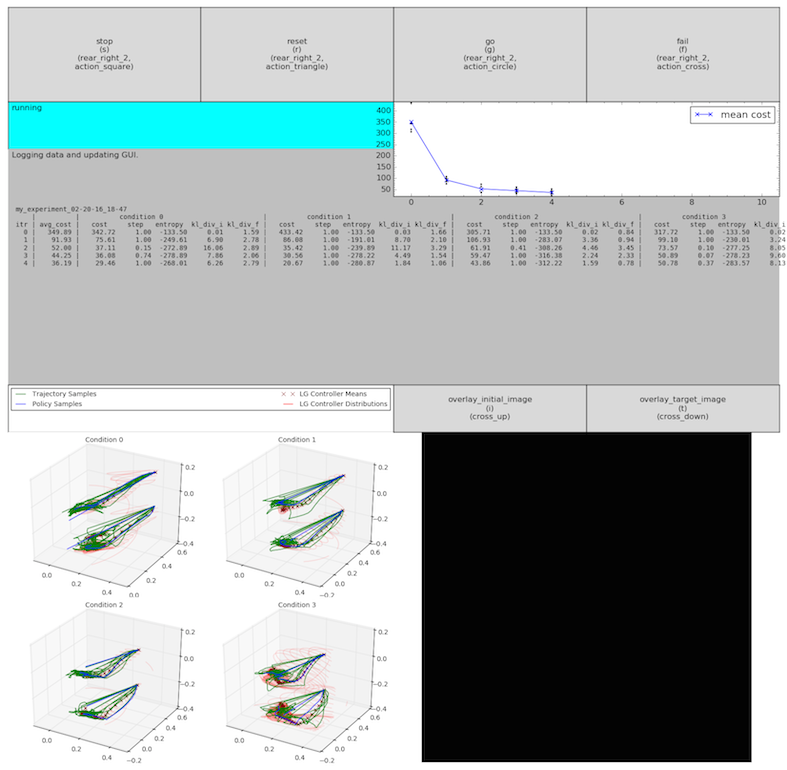
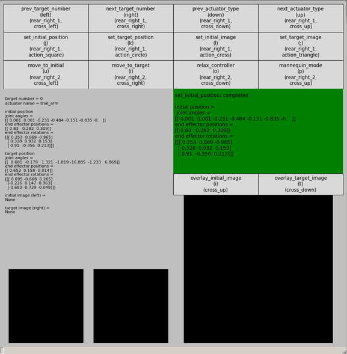

GUI Docs
========

There are two GUI interfaces which are useful for interacting with and visualizing experiments, documented below.

*****

## GPS Training GUI
`python python/gps/gps_main.py <EXPERIMENT_NAME>`

The GPS Training GUI is composed of seven parts:

**The Action Panel:** Consists of 4 actions which can be performed by clicking the button, pressing the keyboard shortcut, or using the PS3 Controller shortcut:

* `stop` - stop the robot from collecting samples (after the current sample has completed), used to perform a manual reset of the robot's arms
* `reset` - reset the robot to the initial position (after the current sample has completed), used to perform a manual reset of the objects in the scene
* `go` - start/restart the robot to collect samples (after using `stop`, `reset`, or `fail`), used to resume training after stop, reset or fail
* `fail` - fail the current sample being collected and recollect that sample (after the current sample has completed), used to recollect a sample that was conducted under faulty conditions

**The Action Status Textbox:** Indicates whether or not the actions were performed successfully or failed.

**The Algorithm Status Textbox:** Indicates the current status of the algorithm (sampling, calculating, logging data, etc.).

**The Cost Plot:** After each iteration, plots the cost per condition (as points) and the mean cost (as a connected line between iterations).

**The Algorithm Output Textbox:** After each iteration, outputs the iteration number and the mean cost, and for each condition, the cost, the step_multiplier, the linear Gaussian controller entropy, and the initial and final KL Divergences (for BADMM only).
To change what is printed, see the `update` method of `gps_training_gui.py`.

**The 3D Trajectory Visualizer:** After each iteration, plots the trajectory samples collected (green lines), the policy samples collected (blue lines), the linear gaussian controller means (dark red crosses), and the linear gaussian controller distributions (red ellipses).

**The Image Visualizer:** Displays the real-time images outputted by the PR2's on-board Kinect. Contains the below two actions:
* `overlay_initial_image` - overlays the initial image set by the Target Setup GUI (press `reset` at the end of sampling to reset the robot to the initial position and check if the image matches the initial image set by the Target Setup GUI
* `overlay_target_image` - overlays the target image set by the Target Setup GUI (press `stop` at the end of sampling to stop the robot at the target position and check if the image matches the target image set by the Target Setup GUI

*****

## Target Setup GUI (for ROS only)
`python python/gps/gps_main.py <EXPERIMENT_NAME> -t`

The Target Setup GUI is composed of four parts:

**The Action Panel**: Consists of 12 actions which can be performed by clicking the button, pressing the keyboard shortcut, or using the PS3 Controller shortcut:
* `prev_target_number` - switch to the previous target number (0-9)
* `next_target_number` - switch to the next target number (0-9)
* `prev_actuator_type` - switch to the previous actuator type (TRIAL_ARM, AUXILIARY_ARM)
* `next_actuator_type` - switch to the next actuator type (TRIAL_ARM, AUXILIARY_ARM)
* `set_initial_position` - set the initial position (manually move the robot to the desired position and then press set)
* `set_target_position` - set the target position (manually move the robot to the desired position and then press set)
* `set_initial_image` - set the initial image (associated with the initial position)
* `set_target_image` - set the target image (associated with the target position)
* `move_to_initial` - move to the initial position (queries AgentROS to physically move the robot and lock in place)
* `move_to_target` - move to the target position (queries AgentROS to physically move the robot and lock in place)
* `relax_controller` - relaxes the robot controllers, so they can be moved again (after `move_to_initial` or `move_to_target` locks them in place)
* `mannequin_mode` - toggles mannequin mode on or off (for the robot's arms to stay in place after physically moving them)

**The Action Status Textbox**: Indicates whether or not the actions were performed successfully or failed.

**The Targets Textbox**: Displays the target values for the current target number and actuator type, including:
* `target number` - the current target number
* `actuator type` - the current actuator type
* `initial pose` - the initial poses' `joint angles`, `end effector points`, and `end effector rotations`
* `target pose` - the target poses' `joint angles`, `end effector points`, and `end effector rotations`
* `initial image` - the initial image associated with the initial pose, displayed on the bottom left
* `target image` - the target image associated with the target pose, displayed on the bottom right

**The Image Visualizer**: Displays the real-time images outputted by the PR2's on-board Kinect (defaults to the topic /camera/rgb/image_color). Has options to overlay the initial image and the target image.

*****

## GUI FAQ

**1. Where do I find the configuration options for the GUIs?**

GUI configuration options are located in `/path/to/gps/python/gps/gui/config.py`. You can change the following options:
* `keyboard_bindings` - controls the keyboard shortcut bindings
* `ps3_bindings` - controls the ps3 controller bindings
* `image_on` - controls whether or not to display the image visualizer
* `image_topic` - sets the rostopic from which to listen for images
* `image_size` - sets the size of images, images above this size will be cropped
* `figsize` - controls the default figure size for the GUIs
* `target_output_fontsize` - controls the font size for the target output
* `initial_mode` - starts the GPS Training GUI in this mode (`'run'` to run on start, `'wait'` to wait on start)`
* `algthm_output_fontsize` - controls the font size for the algorithm output
* `algthm_output_max_display_size` - controls the max display size (maximum number of lines) for the algorithm output

**2. Why is the algorithm output text overflowing?**

Matplotlib does not handle drawing text very smoothly. Here are some options:
* Decrease the amount of iteration data printed (see the `_output_column_titles` and `_update_iteration_data` functions of `gps_training_gui.py`)
* Decrease the algorithm output fontsize, `algthm_output_fontsize`
* Decrease the algorithm output max display size, `algthm_output_max_display_size`
* Increase the default figure size, `figsize`
* Manually increase the figure size by resizing the window

**3. I am not using images. How do I turn off the Image Visualizer?**

Set `image_on` to `False`.

**4. How do I change the experiment information displayed at the start of training?**

See the `generate_experiment_info` function at the bottom of the `gui/config.py` file.

**5. How do I turn off the GPS Training GUI?**

In the experiment `hyperparams.py` file, look for the `config` dictionary at the bottom of the file, and then set the `gui_on` field to `False`. GPS training will still run; however, you will be unable to interact with it through `stop`, `go`, `fail`, and `reset` or see any plots or visualizations.

**6. I want to change the layout or content of the GUIs. How do I use the GUI components?**

For basic examples of how to use the GUI components, see the GUI demos located at `/path/to/gps/python/tests/tests_gui/gui_demos.py`. The code in `gui/gps_training_gui.py` and `gui/target_setup_gui.py` is also designed to be reusable and reconfigurable.
