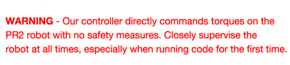
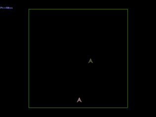
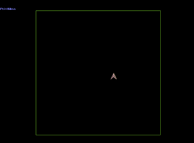
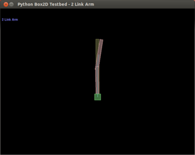
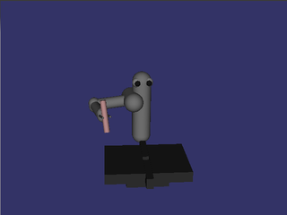
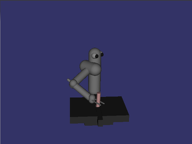
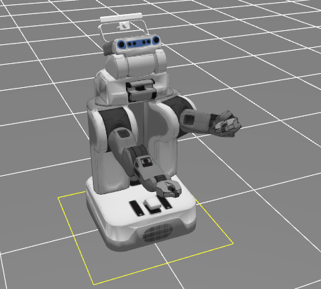
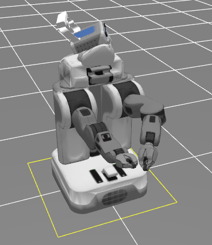

Guided Policy Search
===

This code is a reimplementation of the guided policy search algorithm and LQG-based trajectory optimization, meant to help others understand, reuse, and build upon existing work.
It includes a complete robot controller and sensor interface for the PR2 robot via ROS, and an interface for simulated agents in Box2D and MuJoCo.
Source code is available on [GitHub](https://github.com/cbfinn/gps).

While the core functionality is fully implemented and tested, the codebase is **a work in progress**. See the [FAQ](faq.html) for information on planned future additions to the code.

*****

## Relevant work

Relevant papers which have used guided policy search include:
* Sergey Levine\*, Chelsea Finn\*, Trevor Darrell, Pieter Abbeel. *End-to-End Training of Deep Visuomotor Policies*. 2015. arxiv 1504.00702. [[pdf](http://arxiv.org/pdf/1504.00702.pdf)]
* Marvin Zhang, Zoe McCarthy, Chelsea Finn, Sergey Levine, Pieter Abbeel. *Learning Deep Neural Network Policies with Continuous Memory States*. ICRA 2016. [[pdf](http://arxiv.org/pdf/1507.01273.pdf)]
* Chelsea Finn, Xin Yu Tan, Yan Duan, Trevor Darrell, Sergey Levine, Pieter Abbeel. *Deep Spatial Autoencoders for Visuomotor Learning*. ICRA 2016.  [[pdf](http://arxiv.org/pdf/1509.06113.pdf)]
* Sergey Levine, Nolan Wagener, Pieter Abbeel. *Learning Contact-Rich Manipulation Skills with Guided Policy Search*. ICRA 2015. [[pdf](http://rll.berkeley.edu/icra2015gps/robotgps.pdf)]
* Sergey Levine, Pieter Abbeel. *Learning Neural Network Policies with Guided Policy Search under Unknown Dynamics*. NIPS 2014. [[pdf](http://www.eecs.berkeley.edu/~svlevine/papers/mfcgps.pdf)]

If the codebase is helpful for your research, please cite any relevant paper(s) above and the following:
* Chelsea Finn, Marvin Zhang, Justin Fu, Xin Yu Tan, Zoe McCarthy, Emily Scharff, Sergey Levine. Guided Policy Search Code Implementation. 2016. Software available from rll.berkeley.edu/gps.

For bibtex, see [this page](bibtex.html).

*****

## Installation

#### Dependencies

The following are required
* [python 2.7](https://www.python.org/download/releases/2.7/), [numpy](http://www.numpy.org) (v1.7.0+), [matplotlib](http://matplotlib.org) (v1.5.0+), [scipy](http://scipy.org) (v0.11.0+)
* [boost](http://www.boost.org/), including boost-python
* [protobuf](https://developers.google.com/protocol-buffers/) (apt-get packages libprotobuf-dev and protobuf-compiler)

One or more of the following agent interfaces is required. Set up instructions for each are below.
* [Box2D](https://github.com/pybox2d/pybox2d)
* [ROS](http://ros.org)
* [MuJoCo](https://www.roboti.us/)

One of the following neural network libraries is required for the full guided policy search algorithm
* [Caffe](http://caffe.berkeleyvision.org/) (master branch as of 11/2015, with pycaffe compiled, python layer enabled, PYTHONPATH configured)
* [TensorFlow](http://tensorflow.org)

#### Setup

Follow the following steps to get set up:

1. Install necessary dependencies above.

2. Clone the repo:

    ```sh
    git clone https://github.com/cbfinn/gps.git
    ```

3. Compile protobuffer:

    ```sh
    cd gps
    ./compile_proto.sh
    ```
4. Set up one or more agents below.

**Box2D Setup** (optional)

Here are the instructions for setting up [Pybox2D](https://github.com/pybox2d/pybox2d).

1. Install Swig and Pygame:

    ```sh
    sudo apt-get install build-essential python-dev swig python-pygame subversion
    ```
2. Check out the Pybox2d code via SVN

    ```sh
    svn checkout http://pybox2d.googlecode.com/svn/trunk/ pybox2d
    ```

3. Build and install the library:

    ```sh
    python setup.py build
    sudo python setup.py install
    ```

**MuJoCo Setup** (optional)

In addition to the dependencies listed above, [OpenSceneGraph](http://www.openscenegraph.org/)(v3.0.1+) is also needed. It can be installed by running `sudo apt-get install openscenegraph libopenscenegraph-dev`.

1. [Install MuJoCo](https://www.roboti.us/) (v1.22+) and place the downloaded `mjpro` directory into `gps/src/3rdparty`.
MuJoCo is a high-quality physics engine and requires requires a license.
Obtain a key, which should be named `mjkey.txt`, and place the key into the `mjpro` directory.

2. Build `gps/src/3rdparty` by running:
    ```sh
    cd gps/build
    cmake ../src/3rdparty
    make -j
    ```

3. Set up paths by adding the following to your `~/.bashrc` file:
    ```sh
    export LD_LIBRARY_PATH=$LD_LIBRARY_PATH:/path/to/gps/build/lib
    export PYTHONPATH=$PYTHONPATH:/path/to/gps/build/lib
    ```
    Don't forget to run `source ~/.bashrc` afterward.

**ROS Setup** (optional)

1. Install [ROS](http://ros.org), including the standard [PR2 packages](http://wiki.ros.org/Robots/PR2)

2. Set up paths by adding the following to your `~/.bashrc` file:

    ```sh
    export ROS_PACKAGE_PATH=$ROS_PACKAGE_PATH:/path/to/gps:/path/to/gps/src/gps_agent_pkg
    ```
    Don't forget to run `source ~/.bashrc` afterward.
3. Compilation:

    ```sh
    cd src/gps_agent_pkg/
    cmake .
    make -j
    ```


 


[//]: # (<font color='red'> **WARNING** - Our controller directly commands torques on the <br/> PR2 robot with no safety measures. Closely supervise the </br> robot at all times, especially when running code for the first time.</font>)

**ROS Setup with Caffe** (optional)

This is required if you intend to run neural network policies with the ROS agent.

0. Run step 1 and 2 of the above section.

1. Checkout and build caffe, including running `make -j && make distribute` within caffe.

2. Compilation:

    ```sh
    cd src/gps_agent_pkg/
    cmake . -DUSE_CAFFE=1 -DCAFFE_INCLUDE_PATH=/path/to/caffe/distribute/include -DCAFFE_LIBRARY_PATH=/path/to/caffe/build/lib
    make -j
    ```

    To compile with GPU, also include the option `-DUSE_CAFFE_GPU=1`.

*****

## Examples

#### Box2D example

There are two examples of running trajectory optimizaiton using a simple 2D agent in Box2D. Before proceeding, be sure to [set up Box2D](#setup).

Each example starts from a random controller and learns through experience to minimize cost.

The first is a point mass learning to move to goal position.

  

To try it out, run the following from the gps directory:
```
python python/gps/gps_main.py box2d_pointmass_example
```

The progress of the algorithm is displayed on the [GUI](gui.html).
The point mass should start reaching the visualized goal by around the 4th iteration.

The second example is a 2-link arm learning to move to goal state.

  

To try it out, run this:
```
python python/gps/gps_main.py box2d_arm_example
```

The arm should start reaching the visualized goal after around 6 iterations.

All settings for these examples are located in `experiments/box2d_[name]_example/hyperparams.py`,
which can be modified to input different target positions and change various hyperparameters of the algorihtm.

#### MuJoCo example

To run the mujoco example, be sure to first [set up MuJoCo](#setup).

The first example is using trajectory optimizing for peg insertion. To try it, run the following from the gps directory:
```
python python/gps/gps_main.py mjc_example
```
Here the robot starts with a random initial controller and learns to insert the peg into the hole.
The progress of the algorithm is displayed on the [GUI](gui.html).

  

Now let's learn to generalize to different positions of the hole. For this, run the guided policy search algorithm:
```
python python/gps/gps_main.py mjc_badmm_example
```

The robot learns a neural network policy for inserting the peg under varying initial conditions.

To tinker with the hyperparameters and input, take a look at `experiments/mjc_badmm_example/hyperparams.py`.

#### PR2 example

To run the code on a real or simulated PR2, be sure to first follow the instructions above for ROS setup.

###### 1. Start the controller

**Real-world PR2**

On the PR2 computer, run:

```sh
roslaunch gps_agent_pkg pr2_real.launch
```

This will stop the default arm controllers and spawn the GPSPR2Plugin.

**Simulated PR2**

Note: If you are running ROS hydro or later, open the launch file pr2_gazebo_no_controller.launch and change the include line as specified.

Launch gazebo and the GPSPR2Plugin:

```sh
roslaunch gps_agent_pkg pr2_gazebo.launch
```

###### 2. Run the code

Now you're ready to run the examples via gps_main. This can be done on any machine as long as the ROS environment variables are set appropriately.

The first example starts from a random initial controller and learns to move the gripper to a specified location.

Run the following from the gps directory:

```sh
python python/gps/gps_main.py pr2_example
```

The PR2 should reach the position shown on the right below, and reach a cost of around -600 before the end of 10 iterations.

  

The second example trains a neural network policy to reach a goal pose from different starting positions, using guided policy search:

```sh
python python/gps/gps_main.py pr2_badmm_example
```

To learn how to make your own experiment and/or set your own initial and target positions, see [the next section](#running-a-new-experiment)

#### Running a new experiment
1. Set up a new experiment directory by running:
    ```sh
    python python/gps/gps_main.py my_experiment -n
    ```
    This will create a new directory called my_experiment/ in the experiments directory, with a blank hyperparams.py file.

2. Fill in a hyperparams.py file in your experiment. See [pr2_example](https://github.com/cbfinn/gps/blob/master/experiments/pr2_example/hyperparams.py) and [mjc_example](https://github.com/cbfinn/gps/blob/master/experiments/mjc_example/hyperparams.py) for examples.

3. If you wish to set the initial and/or target positions for the pr2 robot agent, run target setup:

    ```sh
    python python/gps/gps_main.py my_experiment -t
    ```

    See the [GUI documentation](gui.html) for details on using the GUI.

4. Finally, run your experiment
    ```sh
    python python/gps/gps_main.py my_experiment
    ```

All of the output logs and data will be routed to your experiment directory. For more details, see [intended usage](usage.html).

*****

## Documentation

In addition to the inline docstrings and comments, see the following pages for more detailed documentation:

* [Intended Usage](usage.html)
* [GUI for visualization and target setup](gui.html)
* [Configuration and Hyperparameters](hyperparams.html)
* [FAQ](faq.html)

*****

## Learning with your own robot
The code was written to be modular, to make it easy to hook up your own robot. To do so, either use one of the existing agent interfaces (e.g. AgentROS), or write your own.

*****

## Reporting bugs and getting help
You can post questions on [gps-help](https://groups.google.com/forum/#!forum/gps-help). If you want to contribute,
please post on [gps-dev](https://groups.google.com/forum/#!forum/gps-dev). When your contribution is ready, make a pull request on [GitHub](https://github.com/cbfinn/gps).

*****

## Licensing
 This codebase is released under the [CC BY-NC-SA](https://creativecommons.org/licenses/by-nc-sa/4.0/legalcode) license.
